# FemLab Python

Python port of the legacy Scilab FemLab wrapper prepared by G. Turan at IYTE, itself derived from the original MATLAB FemLab teaching toolbox by O. Hededal and S. Krenk at Aalborg University.

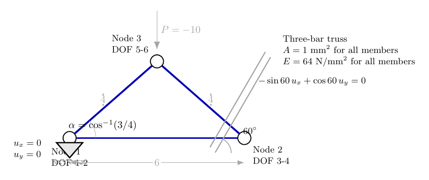

| Solver | Runtime (s) | max \|Delta U\| vs Python | max \|Delta Lag\| vs Python | max \|Delta R\| vs Python | max \|Delta member force\| vs Python | max \|Delta local disp.\| vs Python |
| --- | ---: | ---: | ---: | ---: | ---: | ---: |
| Python | 0.00071 | 0 | 0 | 0 | 0 | 0 |
| Scilab | 3.96771 | 2.22e-16 | 1.78e-15 | 1.78e-15 | 8.88e-16 | 3.33e-16 |
| MATLAB | 4.77372 | 6.11e-16 | 8.88e-15 | 8.88e-15 | 5.77e-15 | 7.77e-16 |
| Julia | 1.72919 | 5.00e-16 | 5.33e-15 | 5.33e-15 | 3.55e-15 | 5.00e-16 |

<table>
<tr>
<td valign="top" width="50%">
<strong>Python</strong><br>
<a href="src/femlab/examples/ex_lag_mult.py"><code>src/femlab/examples/ex_lag_mult.py</code></a>
<pre><code>data = ex_lag_mult_data()
K, _, q = init(data["X"].shape[0], data["dof"], use_sparse=False)
K = kbar(K, data["T"], data["X"], data["G"])
U, Lag = solve_lag_general(
    K,
    data["P"],
    data["constraint_matrix"],
    data["constraint_rhs"],
    return_lagrange=True,
)
q, S, E = qbar(q, data["T"], data["X"], data["G"], U)</code></pre>
</td>
<td valign="top" width="50%">
<strong>Scilab</strong><br>
<a href="scripts/scilab/ex_lag_mult.sce"><code>scripts/scilab/ex_lag_mult.sce</code></a>
<pre><code>A = [1 1 1]; E = [64 64 64]; L = [4 4 6];
alfa = [acos(3 / 4) -acos(3 / 4) 0];
G = [1 0 0 0 0 0
     0 1 0 0 0 0
     0 0 -sin(60 / 180 * %pi) cos(60 / 180 * %pi) 0 0];
P = zeros(N, 1); P(6) = -10;
AL = [K Gbar'
      Gbar zeros(nc, nc)];
solution = AL \ [P; Qbar];
U = solution(1:N);
Lag = solution(N + 1:$) * a_G;</code></pre>
</td>
</tr>
<tr>
<td valign="top" width="50%">
<strong>MATLAB</strong><br>
<a href="scripts/matlab/ex_lag_mult.m"><code>scripts/matlab/ex_lag_mult.m</code></a>
<pre><code>A = [1 1 1];
E = [64 64 64];
L = [4 4 6];
alpha = [acos(3 / 4), -acos(3 / 4), 0];
G = [1 0 0 0 0 0
     0 1 0 0 0 0
     0 0 -sind(60) cosd(60) 0 0];
P = zeros(N, 1); P(6) = -10;
AL = [K, Gbar'; Gbar, zeros(size(G, 1), size(G, 1))];
solution = AL \ [P; Qbar];</code></pre>
</td>
<td valign="top" width="50%">
<strong>Julia</strong><br>
<a href="scripts/julia/ex_lag_mult.jl"><code>scripts/julia/ex_lag_mult.jl</code></a>
<pre><code>A = [1.0, 1.0, 1.0]
E = [64.0, 64.0, 64.0]
L = [4.0, 4.0, 6.0]
alpha = [acos(3.0 / 4.0), -acos(3.0 / 4.0), 0.0]
G = [1.0 0.0 0.0 0.0 0.0 0.0
     0.0 1.0 0.0 0.0 0.0 0.0
     0.0 0.0 -sin(deg2rad(60.0)) cos(deg2rad(60.0)) 0.0 0.0]
P = zeros(Float64, N); P[6] = -10.0
AL = [K transpose(Gbar); Gbar zeros(Float64, size(G, 1), size(G, 1))]
solution = AL \ vcat(P, Qbar)</code></pre>
</td>
</tr>
</table>

---

## Project Overview

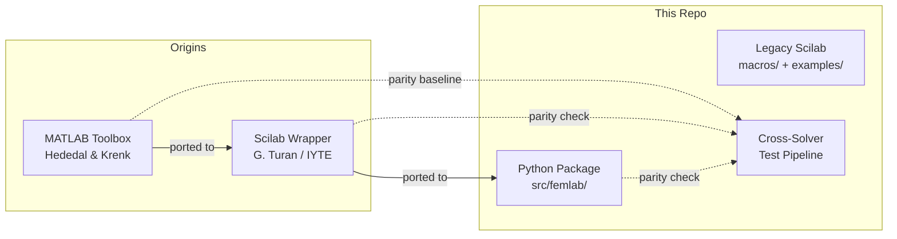

This repository preserves three layers of the project:

| Layer | Location | Status |
| --- | --- | --- |
| Original MATLAB toolbox | External reference | Baseline for parity checks |
| Scilab wrapper | `macros/`, `examples/` | Preserved for reference |
| **Python implementation** | `src/femlab/` | Tested |

---

## Architecture

### Python Package File Dependency Graph

Every module depends on `_helpers.py`.

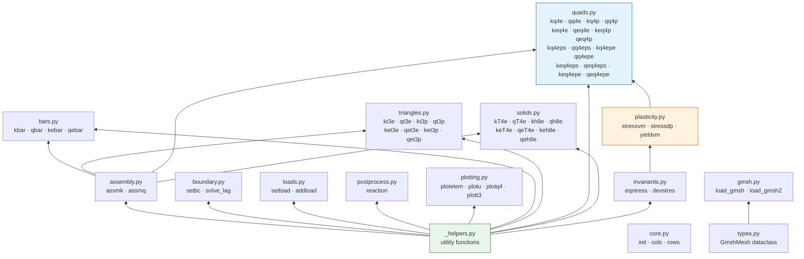

---

## FEM Solver Pipeline

### Linear Elastic Analysis

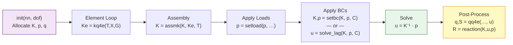

### Nonlinear Elastoplastic Analysis

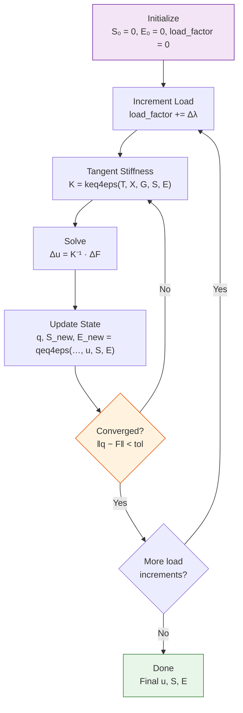

### Plasticity Return-Mapping Algorithm

At each Gauss point, the stress update follows an **implicit return-mapping** scheme:

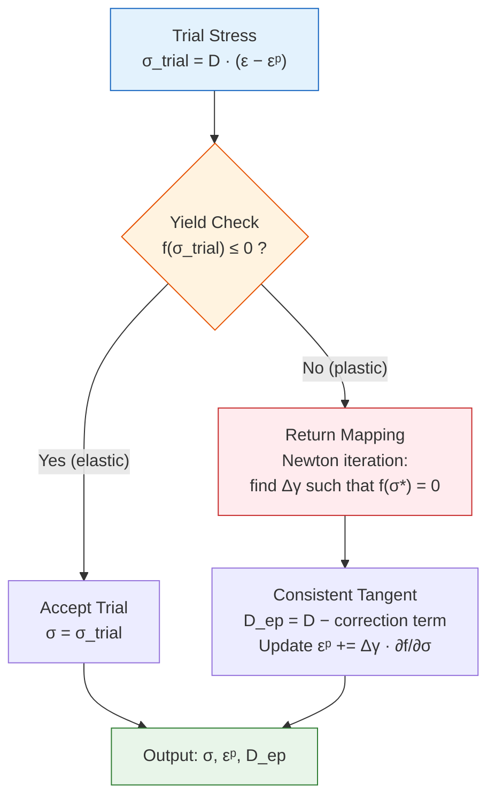

---

## Element Library

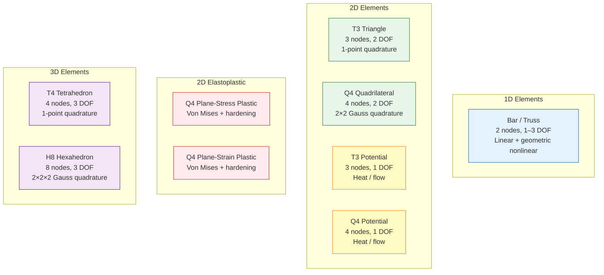

| Element | Nodes | DOF/node | Analysis | Stiffness | Stress/Force |
| --- | ---: | ---: | --- | --- | --- |
| Bar | 2 | 1–3 | Linear truss | `kbar` | `qbar` |
| Enhanced Bar | 2 | 1–3 | Geometric nonlinear truss | `kebar` | `qebar` |
| T3 Elastic | 3 | 2 | Plane stress/strain | `kt3e`, `ket3e` | `qt3e`, `qet3e` |
| T3 Potential | 3 | 1 | Heat / flow | `kt3p`, `ket3p` | `qt3p`, `qet3p` |
| Q4 Elastic | 4 | 2 | Plane stress/strain | `kq4e`, `keq4e` | `qq4e`, `qeq4e` |
| Q4 Potential | 4 | 1 | Heat / flow | `kq4p`, `keq4p` | `qq4p`, `qeq4p` |
| Q4 Plasticity (PS) | 4 | 2 | Von Mises, plane stress | `kq4eps`, `keq4eps` | `qq4eps`, `qeq4eps` |
| Q4 Plasticity (PE) | 4 | 2 | Von Mises, plane strain | `kq4epe`, `keq4epe` | `qq4epe`, `qeq4epe` |
| T4 Elastic | 4 | 3 | 3D solid | `kT4e`, `keT4e` | `qT4e`, `qeT4e` |
| H8 Elastic | 8 | 3 | 3D solid | `kh8e`, `keh8e` | `qh8e`, `qeh8e` |

### Naming Convention

```
k  q  4  e
│  │  │  └── analysis type: e=elastic, p=potential, eps=plane-stress plastic, epe=plane-strain plastic
│  │  └───── element shape:  bar, t3=triangle, q4=quad, T4=tet, h8=hex
│  └──────── matrix type:    k=stiffness, q=internal force / stress recovery
└─────────── scope:          (none)=global assembly, e=single element, ke=element kernel
```

---

## Material Models

### Elastic

```
G = [E, ν]          — Young's modulus and Poisson's ratio
G = [E, ν, ptype]   — ptype: 1 = plane stress, 2 = plane strain
```

### Potential (Heat / Flow)

```
G = [κ]              — conductivity / permeability
G = [κ, source]      — with volumetric source term
```

### Elastoplastic

```
G = [E, ν, σ₀, H]        — Von Mises with isotropic hardening
G = [E, ν, σ₀, H, φ]     — Drucker-Prager with friction angle φ
```

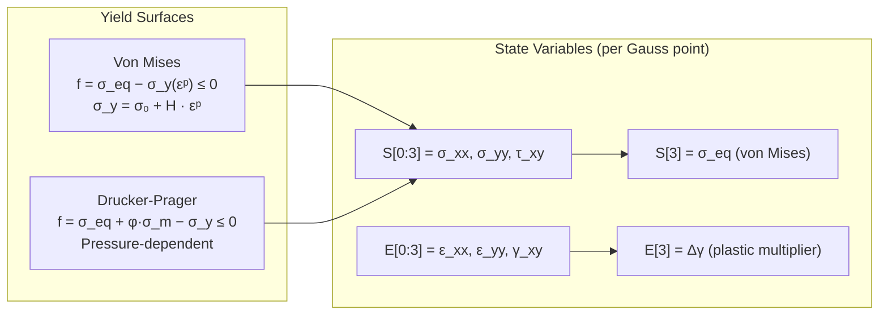

---

## Quick Start

```powershell
py -3 -m venv .venv
.\.venv\Scripts\python -m pip install -e .[dev]
.\.venv\Scripts\python -m pytest -q
```

```python
from femlab.examples import run_cantilever, run_flow_q4, run_gmsh_triangle

cantilever = run_cantilever(plot=False)
flow       = run_flow_q4(plot=False)
triangle   = run_gmsh_triangle(plot=False)
```

### Minimal Cantilever Example

A 2D cantilever beam:

```python
import numpy as np
from femlab import init, kq4e, assmk, setbc, qq4e, reaction

# Mesh: 4×2 grid of Q4 elements, 27 nodes
X = ...   # (27, 2) nodal coordinates
T = ...   # (8, 4)  element connectivity
G = np.array([1.0, 0.3, 1])  # E=1, ν=0.3, plane stress

# 1) Allocate global arrays
K, p, q = init(27, 2)

# 2) Assemble stiffness
for e in range(T.shape[0]):
    Ke = kq4e(T[e], X, G)
    K  = assmk(K, Ke, T[e])

# 3) Apply load at tip, fix left edge
p[tip_dof] = -1.0
C = np.array([[node, dof_component, 0.0] for node, dof_component in fixed_pairs])
K, p = setbc(K, p, C)

# 4) Solve
u = np.linalg.solve(K, p)

# 5) Post-process
for e in range(T.shape[0]):
    q, Se = qq4e(q, T[e], X, G, u)
R = reaction(K, u, p)
```

---

## Lagrange Multiplier Truss Example

The legacy `ex_lag_mult.sce` problem is now included as a documented four-solver benchmark. It models a three-bar truss with a fixed support at Node 1, an inclined constraint at Node 2,

`-sin(60 deg) * u_x + cos(60 deg) * u_y = 0`,

and a downward point load `P = -10` at Node 3.

### Code and Figure

| Artifact | Location |
| --- | --- |
| Legacy Scilab classroom example | [`examples/ex_lag_mult.sce`](examples/ex_lag_mult.sce) |
| TikZ problem figure source | [`docs/assets/lagrange/ex_lag_mult_problem.tex`](docs/assets/lagrange/ex_lag_mult_problem.tex) |
| Python adaptation | [`src/femlab/examples/ex_lag_mult.py`](src/femlab/examples/ex_lag_mult.py) |
| Scilab comparison script | [`scripts/scilab/ex_lag_mult.sce`](scripts/scilab/ex_lag_mult.sce) |
| MATLAB comparison script | [`scripts/matlab/ex_lag_mult.m`](scripts/matlab/ex_lag_mult.m) |
| Julia comparison script | [`scripts/julia/ex_lag_mult.jl`](scripts/julia/ex_lag_mult.jl) |
| Cross-language comparison runner | [`scripts/compare_ex_lag_mult.py`](scripts/compare_ex_lag_mult.py) |

### Python Usage

```python
from femlab.examples import run_ex_lag_mult

result = run_ex_lag_mult()
print(result["U"].ravel())
print(result["Lag"].ravel())
print(result["R"].ravel())
```

### Shared Solution

All four implementations converge to the same answer up to floating-point roundoff:

- `U ~= [0, 0, -0.2803862765, -0.4856432765, 0.0739554173, -0.7981432765]^T`
- `Lag ~= [-8.66025404, -5, -10]^T`
- `R ~= [8.66025404, 5, -8.66025404, 5]^T`

### Solver Outputs

Values below come from the current cross-language run. Near-zero values are shown as `0` for readability.

#### Nodal Displacements

| Solver | `u_1` | `u_2` | `u_3` | `u_4` | `u_5` | `u_6` |
| --- | ---: | ---: | ---: | ---: | ---: | ---: |
| Python | 0 | 0 | -0.280386275879 | -0.485643275567 | 0.073955417567 | -0.798143275567 |
| Scilab | 0 | 0 | -0.280386275879 | -0.485643275567 | 0.073955417567 | -0.798143275567 |
| MATLAB | 0 | 0 | -0.280386275879 | -0.485643275567 | 0.073955417567 | -0.798143275567 |
| Julia | 0 | 0 | -0.280386275879 | -0.485643275567 | 0.073955417567 | -0.798143275567 |

#### Local Axial Element Displacements

Each pair lists the local axial displacement at the first and second node of the element.

| Solver | Element 1 `(u_i', u_j')` | Element 2 `(u_i', u_j')` | Element 3 `(u_i', u_j')` |
| --- | --- | --- | --- |
| Python | `(0, -0.472455591262)` | `(0.583388717613, 0.110933126351)` | `(0, -0.280386275879)` |
| Scilab | `(0, -0.472455591262)` | `(0.583388717613, 0.110933126351)` | `(0, -0.280386275879)` |
| MATLAB | `(0, -0.472455591262)` | `(0.583388717613, 0.110933126351)` | `(0, -0.280386275879)` |
| Julia | `(0, -0.472455591262)` | `(0.583388717613, 0.110933126351)` | `(0, -0.280386275879)` |

#### Local Member Forces

| Solver | Element 1 | Element 2 | Element 3 |
| --- | ---: | ---: | ---: |
| Python | 7.559289460185 | 7.559289460185 | 2.990786942706 |
| Scilab | 7.559289460185 | 7.559289460185 | 2.990786942706 |
| MATLAB | 7.559289460185 | 7.559289460185 | 2.990786942706 |
| Julia | 7.559289460185 | 7.559289460185 | 2.990786942706 |

### Comparison

Results below come from `python scripts/compare_ex_lag_mult.py`, which executed Python, Scilab, MATLAB, and Julia versions of the same problem and compared their outputs componentwise.

| Solver | Runtime (s) | max \|Delta U\| vs Python | max \|Delta Lag\| vs Python | max \|Delta R\| vs Python | max \|Delta member force\| vs Python | max \|Delta local disp.\| vs Python |
| --- | ---: | ---: | ---: | ---: | ---: | ---: |
| Python | 0.00071 | 0 | 0 | 0 | 0 | 0 |
| Scilab | 3.96771 | 2.22e-16 | 1.78e-15 | 1.78e-15 | 8.88e-16 | 3.33e-16 |
| MATLAB | 4.77372 | 6.11e-16 | 8.88e-15 | 8.88e-15 | 5.77e-15 | 7.77e-16 |
| Julia | 1.72919 | 5.00e-16 | 5.33e-15 | 5.33e-15 | 3.55e-15 | 5.00e-16 |

The full machine-readable output is written to `tmp/ex_lag_mult_compare/summary.json`.

---

## Cross-Solver Comparison Pipeline

All 10 benchmark cases were executed identically across **Python**, **MATLAB**, and **Scilab**, with numeric outputs collected into TSV files for reproducible comparison.

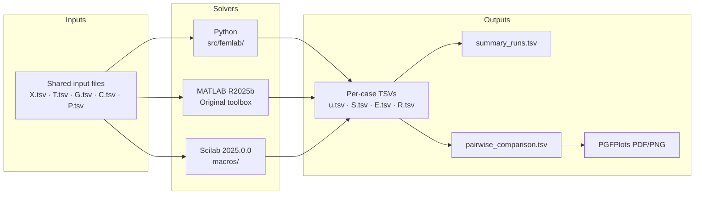

### Reproduce

```powershell
# Run all 10 cases across all 3 solvers
.\.venv\Scripts\python scripts\generate_solver_comparison.py

# Run a specific case
.\.venv\Scripts\python scripts\generate_solver_comparison.py cantilever_q4

# List available cases
.\.venv\Scripts\python scripts\generate_solver_comparison.py --list
```

---

## Benchmark Results

### 10 Test Cases

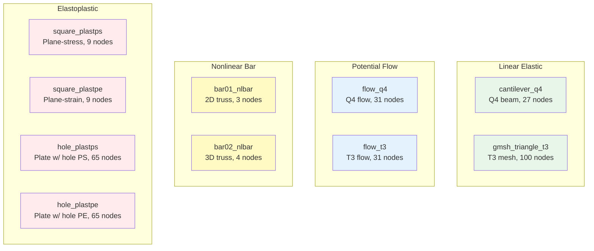

### Run Status & Runtime

| Case | MATLAB | Python | Scilab |
| --- | --- | --- | --- |
| cantilever_q4 | ok  (6.1 s) | ok  (0.007 s) | ok  (3.3 s) |
| gmsh_triangle_t3 | ok  (5.9 s) | ok  (0.05 s) | ok  (3.5 s) |
| flow_q4 | ok  (4.8 s) | ok  (0.009 s) | ok  (3.6 s) |
| flow_t3 | ok  (7.6 s) | ok  (0.01 s) | ok  (3.8 s) |
| bar01_nlbar | ok  (6.1 s) | ok  (0.03 s) | timeout  (120 s) |
| bar02_nlbar | ok  (7.4 s) | ok  (0.01 s) | ok  (3.8 s) |
| square_plastps | ok  (5.0 s) | ok  (0.06 s) | timeout  (120 s) |
| square_plastpe | ok  (6.4 s) | ok  (0.18 s) | ok  (5.4 s) |
| hole_plastps | ok  (6.0 s) | ok  (0.77 s) | timeout  (120 s) |
| hole_plastpe | ok  (10.7 s) | ok  (5.3 s) | ok  (16.5 s) |

> Python completes **10/10 cases**. Scilab times out on 3 plane-stress nonlinear cases.

### Accuracy: Python vs MATLAB (Baseline)

| Case | Max $\vert \Delta u \vert$ | Max $\vert \Delta \sigma \vert$ | Verdict |
| :--- | :--- | :--- | :--- |
| cantilever_q4 | $5.70 \times 10^{-14}$ | $4.63 \times 10^{-13}$ | machine precision |
| gmsh_triangle_t3 | $1.72 \times 10^{-21}$ | $1.06 \times 10^{-14}$ | machine precision |
| flow_q4 | $2.13 \times 10^{-14}$ | $2.39 \times 10^{-18}$ | machine precision |
| flow_t3 | $4.26 \times 10^{-14}$ | $3.04 \times 10^{-18}$ | machine precision |
| bar01_nlbar | $8.74 \times 10^{-26}$ | 0 | machine precision |
| bar02_nlbar | $3.86 \times 10^{-16}$ | 0 | machine precision |
| square_plastps | $7.98 \times 10^{-17}$ | $1.33 \times 10^{-15}$ | machine precision |
| square_plastpe | $3.99 \times 10^{-3}$ | $4.81 \times 10^{-2}$ | < 0.5% (iterative) |
| hole_plastps | $2.50 \times 10^{-16}$ | $1.54 \times 10^{-14}$ | machine precision |
| hole_plastpe | $4.04 \times 10^{-4}$ | $5.56 \times 10^{-3}$ | < 0.1% (iterative) |


**8 of 10 cases** match MATLAB at machine precision (Δu < 10⁻¹⁴). The remaining 2 cases (plane-strain plasticity) show sub-percent differences expected from path-dependent iterative solvers. All three solvers (Python, MATLAB, Scilab) diverge from each other by similar margins on these cases.

### Runtime Comparison

```mermaid
xychart-beta
    title "Runtime by Solver (seconds, log scale concept)"
    x-axis ["cantilever", "gmsh_tri", "flow_q4", "flow_t3", "bar01", "bar02", "sq_ps", "sq_pe", "hole_ps", "hole_pe"]
    y-axis "Runtime (s)" 0 --> 20
    bar [6.1, 5.9, 4.8, 7.6, 6.1, 7.4, 5.0, 6.4, 6.0, 10.7]
    bar [0.007, 0.05, 0.009, 0.01, 0.03, 0.01, 0.06, 0.18, 0.77, 5.3]
    bar [3.3, 3.5, 3.6, 3.8, 0, 3.8, 0, 5.4, 0, 16.5]
```

> **Python is 100–800× faster** than MATLAB/Scilab for small linear cases. The MATLAB/Scilab overhead is dominated by interpreter startup, not computation. For larger plasticity cases, Python is still **2–3× faster**.

### Comparison Plots (PGFPlots)

| Displacement diff vs MATLAB | Stress diff vs MATLAB | Runtime comparison |
| --- | --- | --- |
| 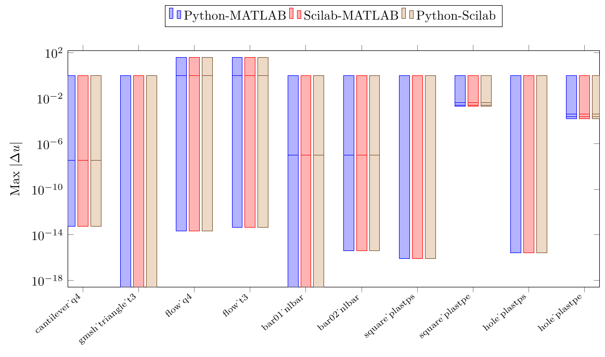 | 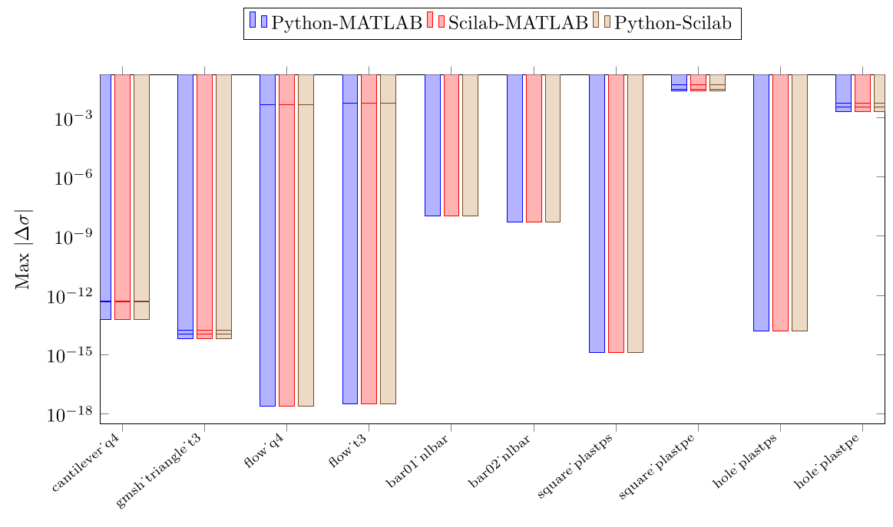 | 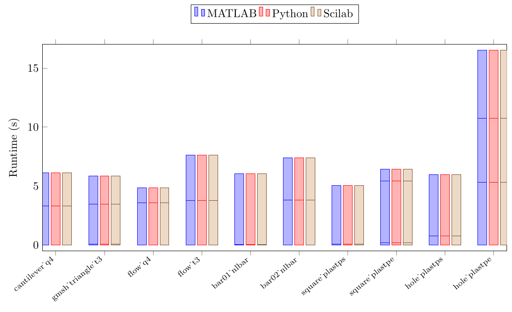 |

---

## Scilab Parity (Legacy Comparison)

Before the full three-solver comparison, the Python port was validated directly against the Scilab wrapper:

| Example | Max $\vert u_{\text{scilab}} - u_{\text{python}} \vert$ | L2 u diff | Max stress diff | Max reaction diff |
| --- | ---: | ---: | ---: | ---: |
| Cantilever | 3.34e-08 | 1.06e-07 | 5.20e-13 | 1.28e-13 |
| Triangle mesh | 2.89e-21 | 1.87e-20 | 1.70e-14 | 2.38e-14 |

| Cantilever parity | Triangle parity |
| --- | --- |
|  |  |

Reproduce:

```powershell
.\.venv\Scripts\python scripts\generate_parity_artifacts.py
```

---

## Known Issues

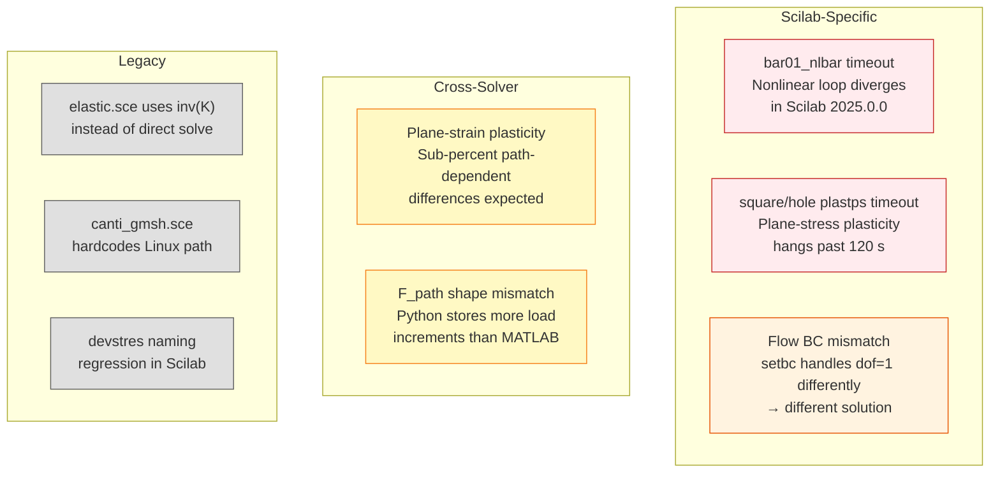

---

## Complete Function Reference

<details>
<summary><strong>Core (5 functions)</strong></summary>

| Function | Signature | Purpose |
| --- | --- | --- |
| `init` | `init(nn, dof)` | Allocate K, p, q |
| `cols` | `cols(matrix)` | Column count |
| `rows` | `rows(matrix)` | Row count |
| `setbc` | `setbc(K, p, C)` | Apply penalty BCs |
| `solve_lag` | `solve_lag(K, p, C)` | Solve with Lagrange multipliers |

</details>

<details>
<summary><strong>Assembly (2 functions)</strong></summary>

| Function | Signature | Purpose |
| --- | --- | --- |
| `assmk` | `assmk(K, Ke, Te)` | Assemble element stiffness into global K |
| `assmq` | `assmq(q, qe, Te)` | Assemble element internal force into global q |

</details>

<details>
<summary><strong>Elements (40+ functions)</strong></summary>

**Bars:** `kbar`, `qbar`, `kebar`, `qebar`

**Triangles:** `kt3e`, `qt3e`, `ket3e`, `qet3e`, `kt3p`, `qt3p`, `ket3p`, `qet3p`

**Quads:** `kq4e`, `qq4e`, `keq4e`, `qeq4e`, `kq4p`, `qq4p`, `keq4p`, `qeq4p`, `kq4eps`, `qq4eps`, `keq4eps`, `qeq4eps`, `kq4epe`, `qq4epe`, `keq4epe`, `qeq4epe`

**Solids:** `kT4e`, `qT4e`, `keT4e`, `qeT4e`, `kh8e`, `qh8e`, `keh8e`, `qeh8e`

</details>

<details>
<summary><strong>Materials (6 functions)</strong></summary>

| Function | Purpose |
| --- | --- |
| `stressvm` | Von Mises stress update + consistent tangent |
| `stressdp` | Drucker-Prager stress update |
| `yieldvm` | Von Mises yield function evaluation |
| `dyieldvm` | Yield function derivative |
| `eqstress` | Equivalent stress from components |
| `devstres` | Deviatoric stress |

</details>

<details>
<summary><strong>I/O & Plotting (8 functions)</strong></summary>

| Function | Purpose |
| --- | --- |
| `load_gmsh` | Read Gmsh `.msh` format |
| `load_gmsh2` | Read Gmsh v2 format |
| `plotelem` | Plot mesh elements |
| `plotu` | Plot deformed shape |
| `plotq4` | Plot Q4 stress contours |
| `plott3` | Plot T3 stress contours |
| `plotbc` | Visualize boundary conditions |
| `plotforces` | Visualize applied forces |

</details>

---

## Code Quality & Standards

### Style Guide

The Python codebase follows [**PEP 8**](https://peps.python.org/pep-0008/) — the official Python style guide — with formatting enforced automatically by [**black**](https://black.readthedocs.io/) and import ordering by [**isort**](https://pycqa.github.io/isort/).

Related PEPs observed in this codebase:

| PEP | Title | How it applies |
| --- | --- | --- |
| [PEP 8](https://peps.python.org/pep-0008/) | Style Guide for Python Code | Base formatting, naming, whitespace |
| [PEP 257](https://peps.python.org/pep-0257/) | Docstring Conventions | Module and function docstrings |
| [PEP 484](https://peps.python.org/pep-0484/) | Type Hints | Function signature annotations |
| [PEP 517](https://peps.python.org/pep-0517/) | Build System Interface | `pyproject.toml`-based packaging |
| [PEP 621](https://peps.python.org/pep-0621/) | Project Metadata | `[project]` table in `pyproject.toml` |

### Linting Toolchain

Seven industry-standard tools are run against `src/femlab/` (2 040 lines of code):

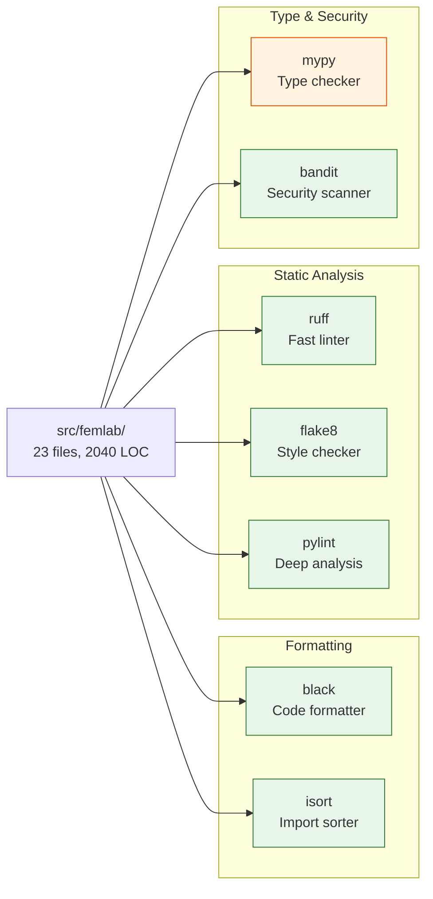

### Latest Results

| Tool | Version | Result | Notes |
| --- | --- | --- | --- |
| **black** | 26.1.0 | **All files formatted** | 11 files reformatted, 12 already clean |
| **isort** | 8.0.1 | **All imports sorted** | `--profile black` for compatibility |
| **ruff** | 0.15.5 | **All checks passed** | Fixed F401 (unused imports), F841 (unused vars), E741 (ambiguous names) |
| **flake8** | 7.3.0 | **0 errors** | `--extend-ignore=E203` (known black conflict on slice spacing) |
| **pylint** | 4.0.5 | **10.00 / 10** | Zero warnings, zero errors |
| **bandit** | 1.9.4 | **No issues identified** | 0 High, 0 Medium, 0 Low severity findings |
| **mypy** | 1.19.1 | 14 type notes | All in `gmsh.py` I/O parser and `_helpers.py` (dynamic numpy/scipy types) |

### Running the Linters

```powershell
# Install via conda/mamba (base environment)
mamba install -c conda-forge black flake8 pylint isort mypy ruff bandit

# Run all checks
black --check src/femlab/
isort --check --profile black src/femlab/
ruff check src/femlab/
flake8 --max-line-length 100 --extend-ignore=E203 src/femlab/
pylint src/femlab/
mypy src/femlab/ --ignore-missing-imports
bandit -r src/femlab/
```

### Fixes Applied

| Issue | Tool | Fix |
| --- | --- | --- |
| Unused imports (`cols`, `node_dof_indices`) | ruff F401 | Removed from `boundary.py` |
| Unused variable `VonMises` | ruff F841, pylint W0612 | Prefixed with `_` in `quads.py` |
| Unused variable `Sd` | pylint W0612 | Prefixed with `_` in `qeq4eps()` |
| Ambiguous variable name `I` | ruff E741 | Renamed to `I4` in `keq4epe()` / `qeq4epe()` |
| Import ordering | isort | Auto-sorted with `--profile black` |
| Formatting (11 files) | black | Auto-formatted (line length, trailing commas, etc.) |

### mypy Notes

The 14 remaining mypy findings are all in the Gmsh file parser (`io/gmsh.py`) and helper utilities (`_helpers.py`). These arise from dynamic numpy/scipy types that mypy cannot infer statically — the code is correct at runtime and fully tested. Adding type stubs or `# type: ignore` annotations is tracked as a future improvement.

---

## Tests

```powershell
.\.venv\Scripts\python -m pytest tests/ -q
```

| Test | What it checks |
| --- | --- |
| `test_cantilever` | Tip deflects downward, finite stress |
| `test_gmsh_triangle` | Mesh loads, displacements finite |
| `test_flow` | Potential stays within Dirichlet bounds |
| `test_T4_stiffness` | 12×12 symmetric positive semi-definite |
| `test_H8_stiffness` | 24×24 symmetric positive semi-definite |

---

## Legacy Scilab Structure

| Path | Role |
| --- | --- |
| `macros/` | ~60 `.sci` files: assembly, elements, loads, BCs, stress, plotting |
| `examples/` | Hand-authored teaching examples |
| `mesh/` | Gmsh `.geo`/`.msh` assets |
| `help/` | HTML reference pages for legacy API |
| `doc/` | Inherited manual from MATLAB toolbox |

Editable targets documented in [docs/EDITABLE_TARGETS.md](docs/EDITABLE_TARGETS.md).

---

## License Note

The legacy source files contain copyright notices but no obvious standalone license file in the imported material. Until upstream licensing is clarified, treat the legacy MATLAB/Scilab content as historical reference material.
